<div align="center">


# deepseek-pet

**在 DeepSeek Harness 的 Web 界面里，养一只二次元小鲸鱼。**

[](LICENSE)


你和 Agent 干活的每一步，它都在右下角吃东西 —— 你发消息喂 🥕、模型回一句喂 🐟、工具跑完一次喂 🍖。
工具循环越密，Combo 越高，特效越夸张，鲸鱼会变**星星眼**。



<sub>一轮工具循环：连击顶到 ×3.0 开暴食 🔥×2、解锁成就、摸摸头，闲下来就睡了（💤）。<br>
这张图是 <a href="docs/make-demo.mjs">docs/make-demo.mjs</a> 拿插件里同一套路径和 keyframes 画出来的，改玩法就 <code>node docs/make-demo.mjs</code> 重出一张。</sub>

装它不用改 dsh 仓库的一个字节，也不用重新构建前端。

</div>

---

## 30 秒装上

把 `dsh-pet-plugin` 目录放到 **dsh 仓库根目录**下，在仓库根执行：

```sh
pnpm dsh plugin --profile web add ./dsh-pet-plugin   # 装
pnpm dsh --profile web --dump-config                 # 确认（应看到 "# == dsh-pet-plugin" 和 pet-feed）
pnpm dsh web                                         # 起 Web
```

打开页面随便说句话 —— 鲸鱼就在右下角开始吃东西了。

装别人给你的 tarball 也一样（见 [打包分发](#打包分发)）：

```sh
pnpm dsh plugin --profile web add ./dsh-pet-plugin-0.3.0.tgz
```

卸载：

```sh
pnpm dsh plugin --profile web remove dsh-pet-plugin
```

> - 装完 / 卸完都要**重启 dsh** 才生效。
> - `web` profile 首次使用会自动从模板初始化（base + web-app）。
> - 用全局安装的 `dsh` 的话，把每条命令的 `pnpm dsh` 换成 `dsh`，参数完全一样。

---

## 打包分发

```sh
node pack.mjs                        # 在本目录执行
# 等价写法（实现就在包里）：
cd dsh-pet-plugin && node scripts/pack.mjs
```

产物落在 `dist/dsh-pet-plugin-<version>.tgz`，发给别人一条 `pnpm dsh plugin add` 装完即用，不需要构建、不需要联网。打包前会自动跑一遍清单校验、产物校验和冒烟测试。

自测（不需要装任何依赖）：

```sh
cd dsh-pet-plugin
node test/smoke.mjs
```

---

## 玩法


Agent 干活就是在喂它：**Combo 与暴食、挑食、心情精力与睡眠、情绪三维、技能树、宠物记忆、几句真的有用的提醒、14 枚成就与每日任务、按等级变形态、摸头拖动与本地存档** —— 一整份玩法清单在 [`dsh-pet-plugin/plugin.md` 的「玩法」](dsh-pet-plugin/plugin.md#玩法)。

想改宠物名字 / 连击窗口 / 食物量 / 关掉特效，或者想知道它是怎么在不改宿主仓库的前提下接上去的、事件从哪来、Combo 怎么算、鲸鱼怎么画的 —— 同一份文档里也都有。

---

## License

[MIT](LICENSE) © zhailiming
