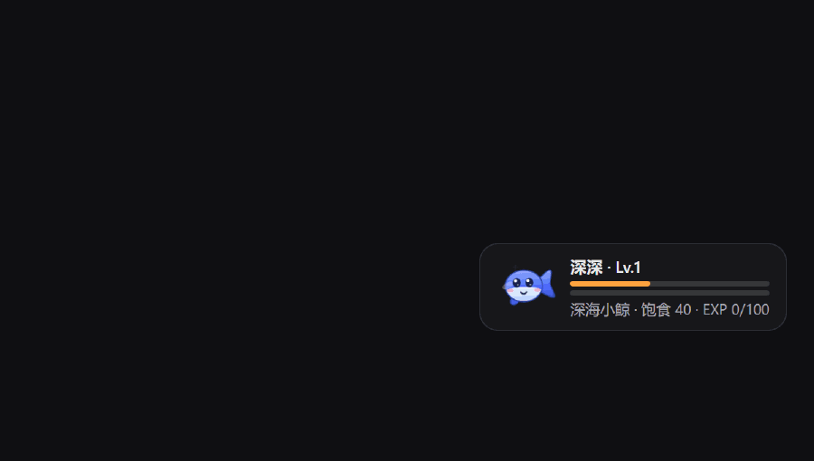
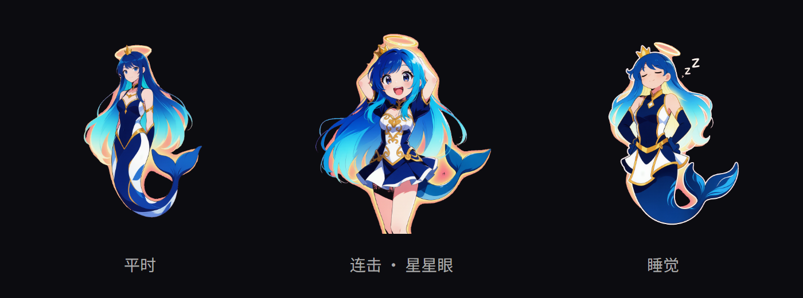

<div align="center">


# deepseek-pet

**在 DeepSeek Harness 的 Web 界面里，养一只二次元小鲸鱼。**

[](LICENSE)


你和 Agent 干活的每一步，它都在右下角吃东西 —— 你发消息喂 🥕、模型回一句喂 🐟、工具跑完一次喂 🍖。
工具循环越密，Combo 越高，特效越夸张，鲸鱼会变**星星眼**。



<sub>真实录屏：一轮工具循环把 Combo 从 ×1 推到 ×10，鲸鱼吃到星星眼。</sub>

装它不用改 dsh 仓库的一个字节，也不用重新构建前端。

</div>

---

## 为什么好玩

- 🐳 **DeepSeek 的鲸鱼，二次元 Q 版**：圆身子、大高光眼、腮红、头顶喷水柱；平时浮沉摆尾、5 秒眨一次眼，喂食时张嘴脸红。整只鲸鱼是**内联 SVG**，不加载任何图片资源。
- 🐋 **越养越大只**：等级带来 4 档形态，**体型从 34px 长到 64px**（差了将近两倍），颜色从近乎白的淡蓝沉到海军蓝，而且每档换一处剪影 —— 幼崽（小、大眼、还不会喷水）→ 少年（喷水柱）→ 成年（大背鳍）→ 传说（金色描边 + 王冠）。跨档那一刻飘一条「进阶 · 成年」，头像外面炸开一圈金环。
- ⚡ **Agent 干得越猛，它吃得越爽**：连击 1~3 白字，4~6 金字加震动，7~10 彩虹渐变 + 光环脉冲 + 星星眼，经验倍率最高 3.0x。
- 🍽️ **吃多少由 token 消耗量说话**：食物量走对数曲线（token 每翻一倍多给 2.5 份），食物本身还按量级分四档 —— 一句「好」是一株 🌱，一次几万 token 的大工具结果是一整锅 🍲，飘字里直接写着这一口多少 token。
- 💾 **进度不会因为刷新归零**：等级、经验、累计消耗都落在浏览器本地，关标签页也在；离开的这段时间它会慢慢饿，回来先喂一口。多开标签页养的是同一只。
- 🍬 **饿了你可以亲自喂**：Agent 不干活的时候，卡片上那颗糖点一下就喂一口，饿着的时候它会自己跳起来提醒你（进度条变红、鲸鱼耷脸）。零食是有库存的（5 格、45 秒回一格、离线也在攒），所以点不出等级，也**永远不会饿死**。
- 🎯 **食物从事件真实发生的位置飞过来**：从你刚发的那条消息、刚跑完的那个工具，一路飞到鲸鱼嘴边，而全程只是一条 CSS 动画。
- 🔌 **零侵入、零构建**：out-of-tree 插件包，一条 `plugin add` 装完即用，不需要 tsdown、不需要联网、不需要 pnpm 的 `allowBuilds` 授权。
- 🧪 **零依赖自测**：`node test/smoke.mjs` 用桩件把产物真跑一遍，连"飞行位移算得对不对""鲸鱼部件齐不齐"都断言。

---

## 30 秒装上

把 `dsh-pet-plugin` 目录放到 **dsh 仓库根目录**下，在仓库根执行：

```sh
pnpm dsh plugin --profile web add ./dsh-pet-plugin   # 装
pnpm dsh --profile web --dump-config                 # 确认（应看到 "# == dsh-pet-plugin" 和 pet-feed）
pnpm dsh web                                         # 起 Web
```

打开页面随便说句话 —— 鲸鱼就在右下角开始吃东西了。

装别人给你的 tarball 也一样（见 [打包分发](#打包分发)）：

```sh
pnpm dsh plugin --profile web add ./dsh-pet-plugin-0.1.0.tgz
```

卸载：

```sh
pnpm dsh plugin --profile web remove dsh-pet-plugin
```

> - 装完 / 卸完都要**重启 dsh** 才生效。
> - `web` profile 首次使用会自动从模板初始化（base + web-app）。
> - 用全局安装的 `dsh` 的话，把每条命令的 `pnpm dsh` 换成 `dsh`，参数完全一样。

---

## 玩法



- 食物从会话里事件发生的位置**飞过来**落到鲸鱼嘴边，跟着冒 `+13 🐠 · 2.0k tok  +3 ⭐` 的飘字。
- **这一口有多大，看 token 消耗量**：`< 120` token 是小食（🌱/🍤/🍢），`≥ 5000` 是大餐（🍉/🐋/🍲，带暖色光晕），字号从 16px 一路长到 38px。generation 按 `input + output` 的全量算。
- 连续动作攒 Combo：白字 → 金字（震动）→ 彩虹（强震 + 光环），最高档鲸鱼换**星星眼 + O 型嘴**。倍率乘在经验上，食物量那边只加一个 0~+5 的常数，免得连击盖过消耗量本身。
- 卡片上两条进度条：橙色是饱食度，蓝色是当前等级的经验；攒够 `等级 × 100` 经验就升级。**空闲时会慢慢饿**（默认每分钟 +2 饥饿），所以食物量的大小一直有意义。
- **等级会换长相**：Lv.1-2 幼崽（34px）/ 3-5 少年（44px）/ 6-9 成年（54px）/ 10+ 传说（64px），体型、配色、眼睛比例跟着变，还各多一处剪影（喷水柱 → 大背鳍 → 王冠）。名字行直接写着 `深深 · Lv.6 成年`，鼠标悬停能看到还差几级到下一档。只在**跨档**那一刻有进阶特效，普通升级不打扰你。
- **卡片上的 🍬 是主动喂食**：一口顶 15 点饱食、给 1 点经验，按钮上的数字是还剩几格零食；点空了变灰，45 秒回一格（离线也在攒，所以出门回来能连点 5 口一次喂饱）。手喂**不算连击、不进 token 统计**，所以刷不出等级也不会污染消耗面板。
- **饿了会提醒**：饱食度只剩 20 以内时饱食条变红、鲸鱼耷脸、糖果按钮开始跳。不过它**不会饿死** —— 饥饿封顶就停住，不掉等级也不重置，红条纯粹是催你喂它。
- **点一下卡片**折叠成只剩头像，再点展开；展开时有一行 `消耗 12.3k tok · 🥕2.1k 🐟8.0k 🍖2.2k`，鼠标悬停看心情 / 精力 / 累计喂食次数。折叠状态下 🍬 还在，随时能喂。
- **进度存在浏览器本地**（`localStorage`），刷新、关标签页都不丢；离线期间照样按时长变饿，回来时已经结算好了（最多按 24 小时算）。想重新养一只：控制台执行 `localStorage.removeItem('dsh-pet-plugin/state')`。
- 系统开了「减少动效」时，所有动画自动关闭。

---

## 调参

宠物名字、连击窗口、食物量、要不要特效……都能改。浏览器侧配置走 `localStorage`，在页面控制台执行后**刷新生效**：

```js
localStorage.setItem('dsh-pet-plugin/config', JSON.stringify({
  comboWindowMs: 3000,   // Combo 窗口（默认 5000）
  maxCombo: 20,          // 最大连击（默认 10，注意会抬高经验倍率上限）
  maxFood: 25,           // 单次最大食物量（默认 30）
  tokensPerFood: 30,     // 曲线起点：约等于第一份食物的 token 量（默认 60，越小吃得越多）
  foodPerDouble: 4,      // token 每翻一倍多给几份食物（默认 2.5）
  hungerRegenPerMin: 0,  // 每分钟回升的饥饿度（默认 2；0 = 只降不升）
  manualFeedEnabled: false,   // 关掉主动喂食，卡片上不再有 🍬（默认 true）
  manualFeedFood: 25,    // 一口零食顶多少饱食（默认 15）
  manualFeedExp: 0,      // 一口零食给多少经验（默认 1；0 = 不给）
  manualSnackMax: 10,    // 零食格数上限（默认 5）
  manualSnackRegenMs: 10000,  // 多久回一格零食（默认 45000；<= 0 = 永远满格）
  hungryAt: 60,          // 饥饿到多少就开始报警（默认 80，即饱食度只剩 20 以内）
  persist: false,        // 关掉进度落盘，回到刷新即重来（默认 true）
  saveDebounceMs: 3000,  // 落盘的合并写窗口（默认 1500）
  offlineRegenCapMs: 3600000, // 离线饥饿最多按多久结算（默认 86400000，即 24h）
  effectsEnabled: false, // 只留宠物卡片，关掉飞行特效（默认 true）
  effectTtlMs: 1500,     // 单条特效时长（默认 2200）
  flyFromConversation: false, // 食物就地飞入，不从会话区飞过来（默认 true）
  freshnessMs: 60000,    // 多久之内的事件才喂（默认 30000）
  petName: '球球',        // 宠物名（默认 '深深'）
  petSpecies: '史莱姆',   // 副标题的种族（默认 '深海小鲸'）
  petAvatar: 'emoji',    // 'whale'（默认）= 二次元鲸鱼；'emoji' = 用下面这个字形
  petIcon: '🐙',         // petAvatar 为 'emoji' 时的头像（默认 🐳）
}))
```

- 只写想改的字段，其余用默认值；类型不匹配的字段静默忽略，非法 JSON 警告一次并整体回退默认值。
- `enabled: false` 直接关掉整个插件（既不观察事件也不显示浮层）。
- 为什么不能改 profile 的 yml：见 [`plugin.md`](dsh-pet-plugin/plugin.md)。

---

## 打包分发

```sh
node pack.mjs                        # 在本目录执行
# 等价写法（实现就在包里）：
cd dsh-pet-plugin && node scripts/pack.mjs
```

产物落在 `dist/dsh-pet-plugin-<version>.tgz`，发给别人一条 `pnpm dsh plugin add` 装完即用，不需要构建、不需要联网。打包前会自动跑一遍清单校验、产物校验和冒烟测试，校验项细节见 [`plugin.md`](dsh-pet-plugin/plugin.md)。

自测（不需要装任何依赖）：

```sh
cd dsh-pet-plugin
node test/smoke.mjs
```

---

## 项目结构

```
deepseek-pet/
├── dsh-pet-plugin/                  插件包本体（这一整个目录就是分发单位）
│   ├── index.js                     host 半：空实现，只为成为一条活着的 Loader entry
│   ├── lib/client.js                浏览器半：手写产物，宠物 / Combo / 特效 / 鲸鱼 SVG 都在这里
│   ├── cordis.patch.yml             配置层：往 profile 里插一行 Loader 记录
│   ├── test/smoke.mjs               零依赖冒烟测试
│   └── plugin.md                    插件详解
├── pet-auto-feed-plugin-design.md   策划原文
└── docs/                            README 用的效果图 / 录屏
```

它是怎么在不改宿主仓库的前提下接上去的、事件从哪来、Combo 怎么算、鲸鱼怎么画的、哪些地方偏离了策划 —— 都在 [`dsh-pet-plugin/plugin.md`](dsh-pet-plugin/plugin.md)。

---

## License

[MIT](LICENSE) © zhailiming
